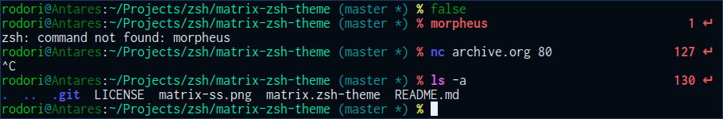

## Matrix ZSH Theme

> I know you're out there. I can feel you now. I know that you're
> afraid... you're afraid of us. You're afraid of change. I don't know the
> future. I didn't come here to tell you how this is going to end. I came
> here to tell you how it's going to begin. I'm going to hang up this
> phone, and then I'm going to show these people what you don't want them
> to see. I'm going to show them a world without you. A world without
> rules and controls, without borders or boundaries. A world where
> anything is possible. Where we go from there is a choice I leave to you.
>
>                                                           -- Neo

## License

**COPY** - **SHARE** - **ENJOY**
